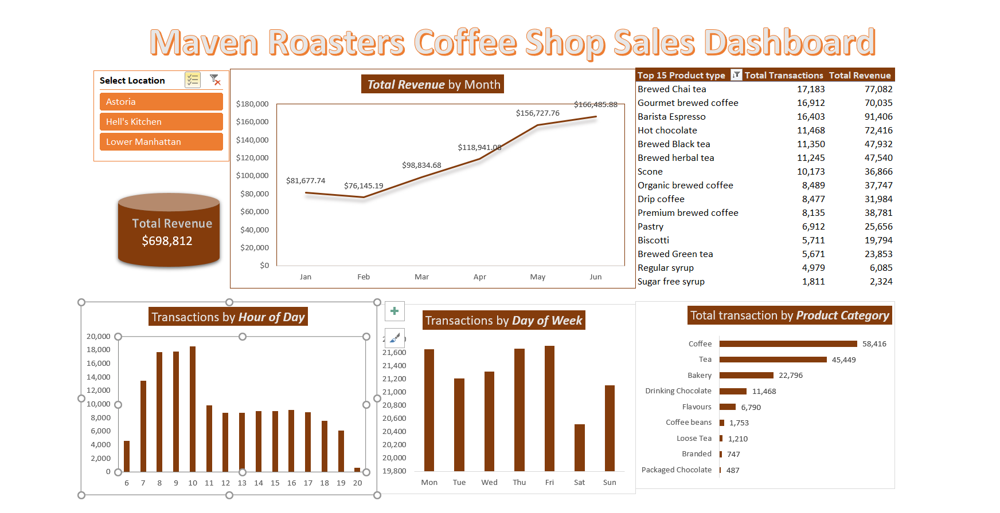

# Maven Roasters Coffee Shop Sales Dashboard

**Interactive Excel Dashboard | PivotTables | Business Intelligence Analysis**

> **Live Interactive Excel Dashboard** analyzing 149,116 transactions and **$698,812** in revenue for a 3-location coffee shop chain (Jan–Jun 2023).

### Project Overview
This project showcases advanced Excel skills through a complete end-to-end sales analysis for Maven Roasters, a fictional New York coffee shop chain with locations in Hell’s Kitchen, Astoria, and Lower Manhattan.

Tasks undertaken:
- Data preparation and feature engineering (Revenue, Month, Day of Week, Hour)
- Multiple PivotTables for time-series and product analysis
- Fully interactive dashboard with Pivot Charts and Store Location slicer

### Tools & Skills Demonstrated in **Microsoft Excel**:
- Data cleaning and preparation
- PivotTables, Pivot Charts, Slicers, Calculated Columns, Date/Time functions, Conditional Formatting
- Dashboard design and data storytelling
- Business insights & actionable recommendations

### Key Insights

- **Revenue Growth**: Strong upward trend — June was the highest month (**$166,486**) while February was the lowest (**$76,145**), likely due to post-holiday slowdown.
- **Peak Days**: Each store has a different peak day. For example, the Lower Manhattan store has the most traffic on Mondays and Thursdays, while  the Hell's Kitchen location is busiest on Tuesdays and Fridays.  Sundays and Saturdays generally have the lowest traffic, except at the Hell's Kitchen location, where Sunday is the 3rd busiest day of the week.
- **Peak Hours**: Clear **morning rush** between **8 AM – 10 AM**. Transactions drop significantly after 11 AM.
- **Top Performing products**:
  - **Barista Espresso** generated the highest revenue (**$91,406**)
  - **Brewed Chai Tea** and **Hot Chocolate** also performed very strongly
  - **Coffee** is the dominant product type, followed by Tea and Bakery
- **Location Performance**: Hell’s Kitchen slightly leads in revenue, while Astoria shows stronger tea sales.

### Actionable Business Recommendations
1. **Staffing Optimization**: Schedule more employees during the peak hours of 8–10 AM daily. Explore floating shifts for employees who can fill in at different locations to staff stores during their busiest days. Reduce afternoon and evening staffing to lower labor costs.
2. **Promotions**: Introduce morning combo deals (Espresso + Scone/Pastry) to increase average order value during peak hours.
3. **Seasonal Strategy**: Launch special promotions or new drinks in February to reduce the observed revenue dip.
4. **Inventory Focus**: Prioritize stock for Barista Espresso, Chai Tea, and Hot Chocolate. Promote tea products more in the Astoria location.

### Dashboard Features
- Revenue trend by month (Line Chart)
- Transactions by Day of Week and Hour of Day (Column Charts)
- Transactions by Product Category (Bar Chart)
- Top 15 Product Types by transactions and revenue
- Interactive **Store Location slicer** connected to all visuals

### How to View the Dashboard
1. Download the file: [`Maven_Roasters_Coffee_Shop_Sales_Dashboard.xlsx`](Maven_Roasters_Coffee_Shop_Sales_Dashboard.xlsx)
2. Open in **Microsoft Excel** (desktop version recommended for best slicer experience)
3. Use the Store Location slicer to filter dynamically (demonstrated in the video)

### Files in Repository
- `Maven_Roasters_Coffee_Shop_Sales_Dashboard.xlsx` → Main interactive file
- `MavensDash.png` → Full dashboard view
- `Coffee Shop Sales.xlsx` →  Raw data file
- `MavensVid.mp4` → Dashboard Video showing slicers

### Connect With Me
- **Email**: mathyastil@gmail.com
- **LinkedIn**: https://www.linkedin.com/in/mathyas-g
- **GitHub**: https://github.com/mathyasg
- **Other Projects**: [Amharic Sentiment Analysis](link) | [Offline Chatbot](link) | [Real-Time Face Detection](link)

---

**Built in Addis Ababa, Ethiopia** | Passionate about turning data into business value
